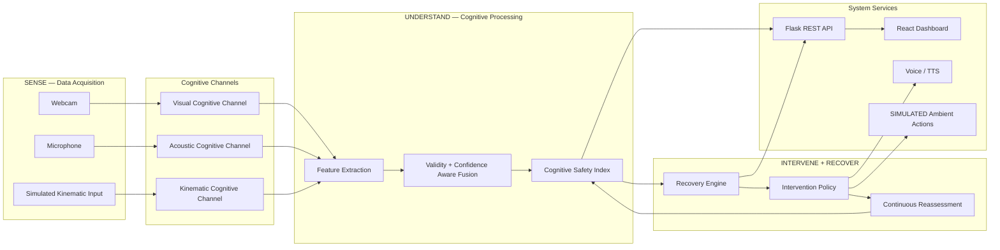
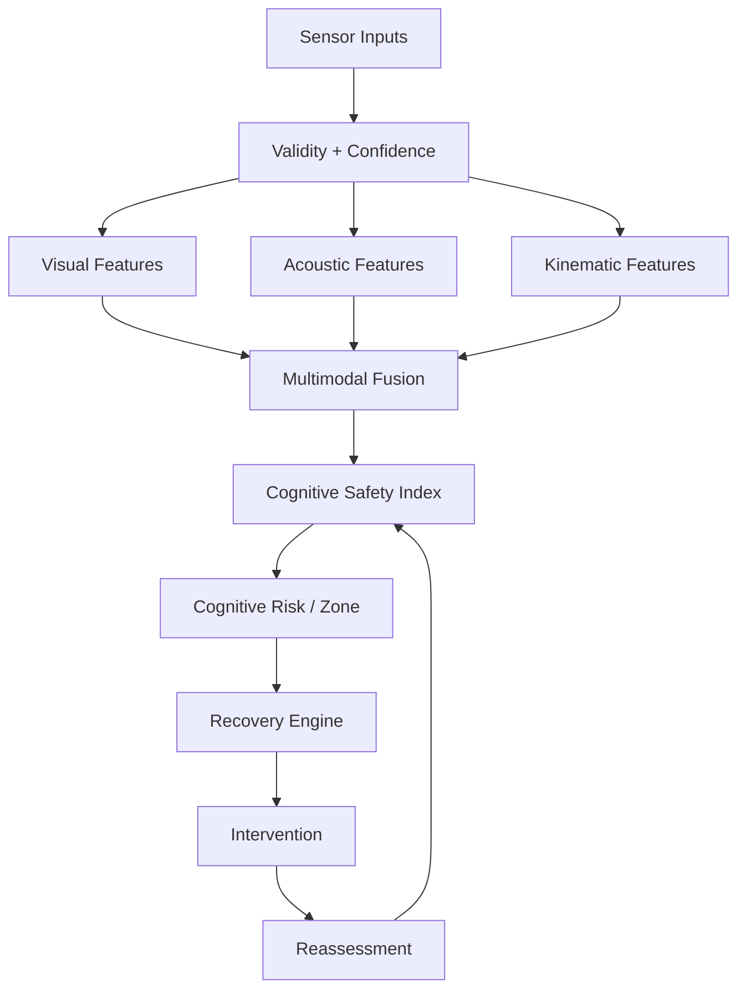
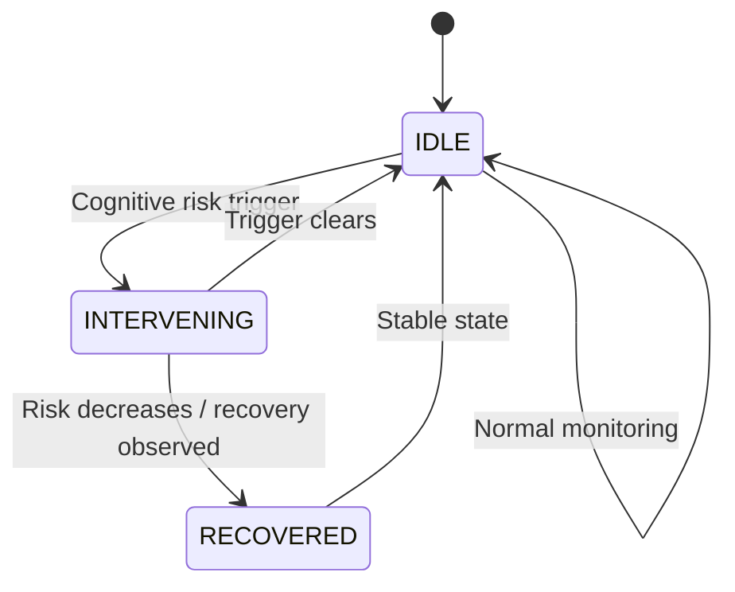
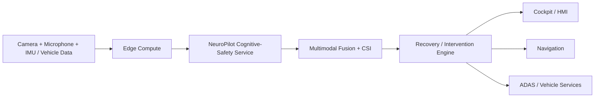
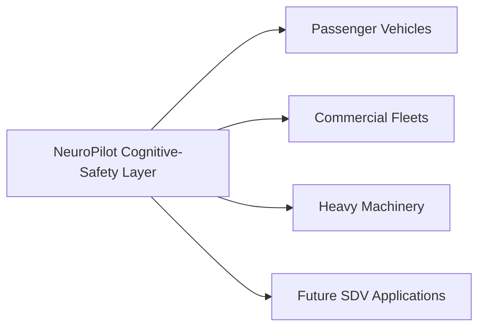
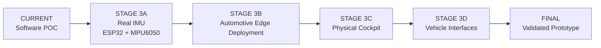

# NeuroPilot AI-X SDV

### Edge AI Cognitive Co-Pilot for Software-Defined Vehicles

**SENSE → UNDERSTAND → INTERVENE → RECOVER**

**Team NeuroPilot**  
Mohit Pal • Praveen Patel  
VIT Bhopal University

**Tata Technologies InnoVent-27 — Stage 2**

<p align="center">


</p>

---

<h1 align="center">🎥 WATCH THE NEUROPILOT POC</h1>

<p align="center">

<a href="https://drive.google.com/file/d/1B-WgzJXLcikhTZGjcROLTIIkPK4l9vz5/view?usp=drive_link">


</a>

</p>

<p align="center">
<b>See NeuroPilot in action: Multimodal Cognitive Sensing → CSI → Intervention → Recovery</b>
</p>

<p align="center">
<b>🎯 Eye State</b> &nbsp; • &nbsp;
<b>🧠 Cognitive Safety Index</b> &nbsp; • &nbsp;
<b>🎙️ Acoustic Channel</b> &nbsp; • &nbsp;
<b>🚗 Kinematic Channel</b> &nbsp; • &nbsp;
<b>🔄 Recovery Engine</b>
</p>

<p align="center">
<i>POC demonstration — current implementation and simulated components are explicitly identified in the project documentation.</i>
</p>

---

## Table of Contents

- [Executive Summary](#executive-summary)
- [The Problem](#the-problem)
- [Why Now](#why-now)
- [The NeuroPilot Solution](#the-neuropilot-solution)
- [Core System Capabilities](#core-system-capabilities)
- [System Architecture](#system-architecture)
- [Runtime Data Flow](#runtime-data-flow)
- [Recovery Engine](#recovery-engine)
- [POC Evidence](#poc-evidence)
- [Sensor Degradation](#sensor-degradation)
- [Validation & Benchmarking](#validation--benchmarking)
- [Performance Measurements](#performance-measurements)
- [Technology Stack](#technology-stack)
- [Competitive Landscape](#competitive-landscape)
- [Why NeuroPilot](#why-neuropilot)
- [Market Opportunity](#market-opportunity)
- [Value Proposition](#value-proposition)
- [SDV & Tata Technologies Alignment](#sdv--tata-technologies-alignment)
- [Scalability](#scalability)
- [Repository Structure](#repository-structure)
- [Installation & Setup](#installation--setup)
- [POC Demonstration](#poc-demonstration)
- [Evidence & Technical Traceability](#evidence--technical-traceability)
- [Current Project Status](#current-project-status)
- [Limitations](#limitations)
- [Roadmap](#roadmap)
- [Privacy & Data Handling](#privacy--data-handling)
- [Third-Party Models & Libraries](#third-party-models--libraries)
- [References](#references)
- [Team](#team)

---

# Executive Summary

**NeuroPilot AI-X SDV** is an Edge AI cognitive-safety software Proof of Concept (POC) for Software-Defined Vehicles.

The system combines multiple driver-state channels — **visual, acoustic, and kinematic** — into a confidence- and validity-aware **Cognitive Safety Index (CSI)**.

Rather than treating driver monitoring as a single event detector, NeuroPilot demonstrates a system-level cognitive-safety loop:

> **SENSE → UNDERSTAND → INTERVENE → RECOVER**

The system continuously observes available signals, extracts cognitive and behavioral features, evaluates sensor validity and confidence, estimates an overall cognitive-risk state through CSI, triggers an intervention policy, and reassesses the driver's state for recovery.

The central project proposition is:

> ### From Cognitive Detection to Cognitive Recovery

The current implementation is a software POC running on development hardware. Kinematic vehicle data is currently simulated, while real IMU hardware, edge deployment, physical cockpit integration, and vehicle-interface integration remain part of the future roadmap.

---

# The Problem

Modern Driver Monitoring Systems (DMS) can identify important driver-state indicators such as eye closure, gaze deviation, head orientation, and other signs of distraction or fatigue.

However, detecting a risk is only one part of the problem.

A cognitive-safety system also needs to answer:

> **What should the vehicle do after a cognitive risk has been detected?**

A driver may experience:

- fatigue
- prolonged eye closure
- distraction
- abnormal head orientation
- changing acoustic state
- unusual vehicle-control behavior
- combinations of several signals

A single sensor does not necessarily provide a complete picture of the driver's state.

NeuroPilot therefore focuses on the transition from:

**Driver-State Detection**

to:

**Confidence-Aware Cognitive-Safety Assessment**

and finally:

**Intervention → Reassessment → Recovery**

The objective is not simply to generate another warning.

The objective is to demonstrate how an SDV-oriented software layer can continuously reason about available cognitive signals and manage a recovery workflow.

---

# Why Now

The automotive industry is moving toward increasingly software-defined and AI-enabled vehicle architectures.

At the same time, driver monitoring is becoming more important as vehicles gain increasingly capable ADAS functions.

Euro NCAP's 2026 assessment direction places increased emphasis on real-time driver monitoring, including continuous eye and head tracking and connecting driver-state information with driver-assistance sensitivity.

This creates an important architectural opportunity:

> **Driver monitoring can evolve from an isolated safety feature into a software service participating in the wider vehicle intelligence layer.**

NeuroPilot explores this direction through:

- multimodal sensing
- edge-oriented processing
- confidence-aware fusion
- cognitive-risk estimation
- adaptive intervention
- continuous reassessment
- recovery-state management

---

# The NeuroPilot Solution

NeuroPilot is structured around a continuous cognitive-safety lifecycle.

```text
SENSE
   ↓
UNDERSTAND
   ↓
INTERVENE
   ↓
RECOVER
```

A more detailed engineering representation is:

```text
SENSE
   ↓
FUSE
   ↓
ASSESS
   ↓
INTERVENE
   ↓
REASSESS
   ↓
RECOVER
```

## 1. SENSE

Collect available driver and vehicle-related signals.

### Visual

- Eye state
- Eye closure
- Gaze
- Head pose
- Face tracking

### Acoustic

- Microphone input
- Voice activity
- Acoustic characteristics
- Arousal
- Valence
- Dominance

### Kinematic

- Velocity
- Jerk
- Rolling variability
- Reversal/correction behavior

> Kinematic input is currently **SIMULATED** in the POC.

## 2. UNDERSTAND

Sensor streams are converted into structured features.

The system considers:

- sensor validity
- sensor confidence
- timestamps
- source
- feature-level risk
- multimodal contribution

These signals are then combined into the:

### Cognitive Safety Index (CSI)

CSI provides a continuously updated representation of the current cognitive-safety state.

## 3. INTERVENE

When the system identifies an elevated cognitive-risk condition, the Recovery Engine can transition into an intervention state.

Depending on the implemented trigger and policy, the POC can demonstrate:

- voice/TTS intervention
- simulated ambient cabin adjustment
- simulated reroute/rest suggestion

Physical cabin controls are **not connected in the current POC**.

## 4. RECOVER

The system does not end the workflow at the intervention.

It continues monitoring the driver.

If the cognitive state returns toward a stable range, the Recovery Engine can transition through:

```text
INTERVENING
     ↓
RECOVERED
     ↓
IDLE
```

This creates the project's central closed-loop concept:

> **Detect → Intervene → Reassess → Recover**

---

# Core System Capabilities

## Visual Cognitive Channel

| Capability | Status |
|---|---|
| Live camera input | **IMPLEMENTED** |
| Face detection and tracking | **IMPLEMENTED** |
| MediaPipe processing | **IMPLEMENTED** |
| Eye Aspect Ratio (EAR) | **IMPLEMENTED** |
| Eye-closure duration | **IMPLEMENTED** |
| Macro-gaze / head orientation | **IMPLEMENTED** |
| Head pose pitch/yaw | **IMPLEMENTED** |
| Micro-gaze / iris position | **IMPLEMENTED** |
| Blink-per-minute tracking | **IMPLEMENTED** |
| Visual validity | **IMPLEMENTED** |
| Visual confidence | **IMPLEMENTED** |
| Visual degradation handling | **IMPLEMENTED** |

## Acoustic Cognitive Channel

| Capability | Status |
|---|---|
| Live microphone input | **IMPLEMENTED** |
| Voice Activity Detection | **IMPLEMENTED** |
| Wav2Vec2-based acoustic inference | **IMPLEMENTED** |
| Arousal | **IMPLEMENTED** |
| Valence | **IMPLEMENTED** |
| Dominance | **IMPLEMENTED** |
| Acoustic risk contribution | **IMPLEMENTED** |

The current acoustic model is:

`audeering/wav2vec2-large-robust-12-ft-emotion-msp-dim`

NeuroPilot uses the model's acoustic representation and emotion-related dimensions as part of the cognitive-safety pipeline.

**Important:** NeuroPilot does not claim that the acoustic model directly diagnoses a medical or psychological condition.

## Kinematic Cognitive Channel

| Capability | Status |
|---|---|
| Steering / vehicle telemetry interface | **SIMULATED** |
| Velocity features | **IMPLEMENTED** |
| Jerk | **IMPLEMENTED** |
| Rolling standard deviation | **IMPLEMENTED** |
| Reversal / correction rate | **IMPLEMENTED** |
| Isolation Forest anomaly detection | **IMPLEMENTED** |
| Real IMU hardware | **PLANNED** |

Kinematic data is explicitly labeled **SIMULATED** until physical vehicle/IMU hardware is integrated.

## Multimodal Fusion & Intelligence

| Capability | Status |
|---|---|
| Cognitive State Engine | **IMPLEMENTED** |
| Sensor validity handling | **IMPLEMENTED** |
| Confidence-aware fusion | **IMPLEMENTED** |
| Timestamp/source handling | **IMPLEMENTED** |
| Cognitive Safety Index (CSI) | **IMPLEMENTED** |
| Sensor degradation handling | **IMPLEMENTED** |
| Available-sensor fallback | **IMPLEMENTED** |
| Recovery Engine | **IMPLEMENTED** |

---

# System Architecture

NeuroPilot currently operates as a software POC composed of:

- sensor-processing pipelines
- Python backend
- cognitive-state/fusion layer
- Recovery Engine
- Flask API
- React dashboard



---

# Runtime Data Flow



---

# Recovery Engine

The Recovery Engine is the central lifecycle manager for cognitive-risk intervention.

Its purpose is to prevent the system from treating a warning as the final outcome.

Conceptually:

```text
NORMAL
  ↓
RISK DETECTED
  ↓
INTERVENING
  ↓
DRIVER STATE REASSESSED
  ↓
RECOVERED
  ↓
NORMAL
```

## State Machine



Where intervention actions are simulated, they are explicitly marked as:

**SIMULATED**

Examples include:

- simulated cabin-light adjustment
- simulated audio-volume reduction
- simulated rest/reroute suggestion

---

# POC Evidence

NeuroPilot has been tested through representative runtime scenarios.

## Verified Recovery Sequence

A representative eye-trigger sequence demonstrated:

```text
Baseline
CSI = 28
State = IDLE

        ↓

Eye-closure event

CSI = 56
Zone = Cognitive Overload
Eye Closure Duration ≈ 6.96 s

Recovery Engine = INTERVENING
Trigger = EYE

        ↓

Risk decreases

CSI = 32
Recovery Engine = RECOVERED

        ↓

Stable state

CSI = 28
Recovery Engine = IDLE
```

This demonstrates the intended lifecycle:

> **Baseline → Risk Escalation → Intervention → Recovery → Normal**

This is a **runtime POC demonstration**, not a statistical accuracy benchmark.

---

# Sensor Degradation

NeuroPilot also demonstrates degraded-sensor handling.

During a camera-occlusion test:

```text
Visual      → DEGRADED
Acoustic    → ACTIVE
Kinematic   → ACTIVE
```

The system continued calculating a cognitive-safety state using the available valid sensor channels.

This demonstrates an important engineering principle:

> **A degraded sensor should not automatically collapse the entire cognitive-safety pipeline.**

The current implementation uses sensor validity/confidence information during fusion.

This should not be interpreted as production-grade functional-safety fault tolerance. Formal automotive validation remains future work.

---

# Validation & Benchmarking

NeuroPilot follows a structured validation approach:

```text
Test Scenario
      ↓
Sensor Inputs
      ↓
NeuroPilot Processing
      ↓
Recorded Telemetry
      ↓
Expected vs Observed
      ↓
Pass / Fail
```

## Validation Categories

| Scenario | Purpose |
|---|---|
| Normal baseline | Establish normal operating state |
| Eye closure | Validate visual fatigue-related trigger |
| Gaze deviation | Validate visual attention signal |
| Head orientation | Validate head-pose signal |
| Acoustic variation | Validate acoustic channel response |
| Kinematic variation | Validate motion/anomaly channel |
| Sensor degradation | Validate fallback behavior |
| Intervention | Validate Recovery Engine trigger |
| Recovery | Validate return toward stable state |

Structured multi-scenario benchmarking remains an ongoing engineering activity.

No fabricated accuracy percentage is reported.

---

# Performance Measurements

The project distinguishes between **MEASURED**, **ESTIMATED**, and **NOT YET MEASURED** values.

| Metric | Value | Status |
|---|---:|---|
| CSI update interval | ~100 ms | **MEASURED** |
| Visual processing rate | ~30 FPS | **ESTIMATED** |
| MediaPipe processing latency | ~15–25 ms | **ESTIMATED** |
| CPU utilization | ~15–20% | **ESTIMATED** |
| GPU utilization | 0% | **MEASURED** |
| Acoustic inference latency | Not yet measured | **PENDING** |
| Fusion latency | Not yet measured | **PENDING** |
| API response latency | Not yet measured | **PENDING** |
| Memory consumption | Not yet measured | **PENDING** |

These values represent the current development environment and should not be interpreted as production automotive benchmarks.

---

# Technology Stack

## Backend

- Python
- Flask
- REST API

## Computer Vision

- OpenCV
- MediaPipe
- Face tracking
- Eye Aspect Ratio
- Gaze estimation
- Head-pose estimation

## Acoustic AI

- PyTorch
- Hugging Face Transformers
- Wav2Vec2
- Voice Activity Detection
- Arousal / Valence / Dominance inference

## Kinematic Processing

- Python signal processing
- Rolling statistics
- Jerk
- Reversal/correction rate
- Isolation Forest anomaly detection

## Frontend

- React
- Vite
- JavaScript
- Tailwind CSS
- Recharts

## Visualization

- Live dashboard
- CSI history
- Sensor state
- Cognitive state
- Recovery state
- Live telemetry

---

# Competitive Landscape

NeuroPilot operates in a rapidly developing driver-monitoring and in-cabin intelligence ecosystem.

Relevant industry examples include:

- Seeing Machines
- Smart Eye
- Cipia
- Bosch
- Magna
- other automotive DMS / interior-sensing providers

These are mature commercial technologies and should not be treated as direct one-to-one competitors to a student-built POC.

Publicly documented systems already demonstrate capabilities such as:

- eye and head tracking
- drowsiness detection
- distraction detection
- real-time alerts
- driver-state estimation
- broader interior sensing

Therefore, NeuroPilot does **not** claim:

> "Existing DMS only detect and warn."

Instead, NeuroPilot's differentiation is framed around the specific architecture and POC implementation described below.

---

# Why NeuroPilot

## 1. Cognitive Recovery Loop

NeuroPilot explicitly models:

> **SENSE → UNDERSTAND → INTERVENE → RECOVER**

The POC demonstrates an actual recovery lifecycle rather than presenting intervention as the final step.

## 2. Multimodal Cognitive-Safety Pipeline

NeuroPilot combines:

```text
VISION
+
ACOUSTIC
+
KINEMATIC
        ↓
MULTIMODAL FUSION
        ↓
CSI
```

The objective is to create a broader cognitive-safety representation than relying on a single signal.

## 3. Confidence & Validity Aware Fusion

Each sensor contribution can carry information such as:

- validity
- confidence
- timestamp
- source
- risk contribution

This enables the system to reason about sensor availability rather than blindly assuming every input is reliable.

## 4. Graceful Sensor Degradation

The POC demonstrates continued operation when one sensor becomes degraded while other valid channels remain available.

This is particularly important for real-world vehicle environments where individual sensors can temporarily become unavailable.

## 5. Explicit Recovery Engine

Instead of:

```text
Detect → Alert → Stop
```

NeuroPilot demonstrates:

```text
Detect
  ↓
Assess
  ↓
Intervene
  ↓
Reassess
  ↓
Recover
```

## 6. SDV-Oriented Software Layer

NeuroPilot is designed as a software-centric cognitive-safety layer that can eventually interface with:

- cockpit systems
- navigation
- infotainment
- vehicle telemetry
- ADAS-related services
- edge compute
- connected vehicle services

These are future integration targets unless explicitly implemented in the current POC.

## 7. Cross-Domain Potential

The same cognitive-safety software concept can potentially be adapted to:

### Passenger Vehicles

Driver cognitive safety and adaptive cockpit.

### Commercial Fleets

Driver-state monitoring and intervention.

### Heavy Machinery

Operator cognitive-state monitoring.

These are potential future application domains, not current production deployments.

---

# Market Opportunity

Driver monitoring and in-cabin sensing are established automotive technology markets.

The market is being influenced by:

- increasing ADAS adoption
- software-defined vehicle architectures
- regulatory requirements
- Euro NCAP driver-monitoring expectations
- AI-enabled cockpit systems
- increasing vehicle software complexity

The market should not be represented by a single exact market-size number because research firms use different definitions and scopes.

The more defensible market statement is:

> **Driver monitoring is already a multi-billion-dollar global technology market, while the broader in-cabin intelligence and SDV software opportunity continues to expand.**

NeuroPilot therefore targets a broader architectural opportunity:

```text
Driver Monitoring
        ↓
Cognitive Safety
        ↓
In-Cabin Intelligence
        ↓
SDV Cognitive-Safety Services
```

---

# Value Proposition

## Safety Value

Potentially enables:

- earlier recognition of cognitive-risk changes
- multimodal assessment
- context-aware intervention
- continuous reassessment

The current POC does not claim measured crash reduction or real-world safety improvement.

## Technical Value

NeuroPilot demonstrates:

- multimodal sensing
- confidence-aware fusion
- sensor degradation handling
- CSI generation
- state-based intervention
- recovery management
- live telemetry
- software-based architecture

## SDV Value

A cognitive-safety function can be treated as a software service rather than an isolated hardware feature.

Potential future integrations include:

```text
NeuroPilot
    ↓
Cognitive Safety Service
    ↓
Cockpit / ADAS / Navigation / Vehicle Services
```

## Scalability Value

Potential deployment domains:

```text
                NeuroPilot
                    │
        ┌───────────┼───────────┐
        ↓           ↓           ↓
 Passenger       Fleet       Heavy
 Vehicles       Vehicles     Machinery
```

The current implementation is a software POC and does not represent production deployment in these domains.

---

# SDV & Tata Technologies Alignment

NeuroPilot aligns conceptually with the direction of software-defined mobility and AI-enabled vehicle engineering.

The project connects to themes including:

- Software-Defined Vehicles
- Edge AI
- Embedded intelligence
- AI-enabled cockpit systems
- Driver monitoring
- ADAS
- Real-time sensing
- Multimodal data processing
- Vehicle software services
- Future OTA/software evolution

Tata Technologies' public materials describe AI-driven in-vehicle intelligence and software-defined mobility as important areas of automotive engineering.

NeuroPilot explores a related software concept:

> **A cognitive-safety intelligence layer that can eventually become part of the vehicle's software-defined architecture.**

This project is an independent student POC and does not represent an official Tata Technologies product or deployment.

---

# SDV Integration Concept

The current POC runs on development hardware.

The intended future architecture is:



### Current POC

```text
Laptop / Development Computer
        ↓
Camera + Microphone
        ↓
NeuroPilot
        ↓
Flask API
        ↓
React Dashboard
```

### Future Target

```text
Vehicle Sensors
        ↓
Automotive Edge Compute
        ↓
NeuroPilot
        ↓
SDV Services
        ↓
Cockpit / Vehicle Systems
```

---

# Scalability

NeuroPilot is designed around a software-layer concept.



The same cognitive-safety pipeline can potentially be adapted to different vehicle domains by changing:

- sensor interfaces
- vehicle signals
- intervention policies
- domain-specific thresholds
- integration interfaces

This remains a future scalability direction rather than a current production deployment.

---

# Repository Structure

```text
NeuroPilot/
│
├── backend/
│   ├── app.py
│   ├── engine.py
│   ├── vision.py
│   ├── acoustic.py
│   ├── kinematic.py
│   ├── recovery_engine.py
│   └── ...
│
├── frontend/
│   ├── src/
│   ├── public/
│   ├── package.json
│   └── ...
│
├── tests/
│   ├── ...
│
├── config/
│   └── ...
│
├── assets/
│   ├── screenshots/
│   └── ...
│
├── requirements.txt
├── package.json
└── README.md
```

> **Note:** The actual repository tree is the authoritative structure. Update this section if file names or folders differ from the current repository.

---

# Installation & Setup

## Prerequisites

- Python 3.x
- Node.js
- npm
- Webcam
- Microphone

For kinematic functionality:

- current POC uses simulated input
- physical IMU is not currently required

## Backend

```bash
cd backend
python -m venv venv
```

### Windows

```powershell
venv\Scriptsctivate
```

### macOS / Linux

```bash
source venv/bin/activate
```

Install dependencies:

```bash
pip install -r requirements.txt
```

Start the backend:

```bash
python app.py
```

## Frontend

Open another terminal:

```bash
cd frontend
npm install
npm run dev
```

Open the URL shown by Vite in the terminal.

---

# POC Demonstration

A recommended demonstration sequence is:

1. Establish the normal baseline.
2. Show live camera, face detection, eye state, gaze, head pose, CSI, and sensor status.
3. Trigger prolonged eye closure.
4. Demonstrate head orientation change.
5. Demonstrate the acoustic channel.
6. Demonstrate the simulated kinematic channel.
7. Show multimodal CSI fusion.
8. Trigger an intervention.
9. Show `INTERVENING → RECOVERED → IDLE`.
10. Demonstrate visual sensor degradation.
11. Show continued operation using available valid channels.

---

# Evidence & Technical Traceability

NeuroPilot follows an evidence-first engineering principle:

> **Every major project claim should be traceable to code, runtime evidence, tests, or documented technical sources.**

| Capability | Evidence | Status |
|---|---|---|
| Visual sensing | Vision implementation + runtime | **IMPLEMENTED** |
| Face tracking | MediaPipe runtime | **IMPLEMENTED** |
| Eye closure | EAR + runtime | **IMPLEMENTED** |
| Gaze | Vision pipeline | **IMPLEMENTED** |
| Head pose | Pitch/yaw processing | **IMPLEMENTED** |
| Acoustic sensing | Acoustic pipeline | **IMPLEMENTED** |
| Wav2Vec2 inference | Model integration | **IMPLEMENTED** |
| Kinematic pipeline | Signal-processing implementation | **IMPLEMENTED / SIMULATED INPUT** |
| Isolation Forest | Kinematic anomaly pipeline | **IMPLEMENTED** |
| CSI | Cognitive State Engine | **IMPLEMENTED** |
| Confidence-aware fusion | Fusion implementation | **IMPLEMENTED** |
| Sensor degradation | Runtime test | **VERIFIED** |
| Recovery Engine | Runtime state transitions | **VERIFIED** |
| Dashboard | React application | **IMPLEMENTED** |
| REST API | Flask backend | **IMPLEMENTED** |
| Real IMU | Hardware roadmap | **PLANNED** |
| Edge deployment | Roadmap | **PLANNED** |
| Physical cockpit | Roadmap | **PLANNED** |
| Vehicle integration | Roadmap | **PLANNED** |

---

# Current Project Status

| Component | Status |
|---|---|
| Visual Cognitive Channel | **IMPLEMENTED** |
| Acoustic Cognitive Channel | **IMPLEMENTED** |
| Kinematic Cognitive Channel | **IMPLEMENTED — SIMULATED INPUT** |
| Cognitive State Engine | **IMPLEMENTED** |
| CSI | **IMPLEMENTED** |
| Confidence-aware fusion | **IMPLEMENTED** |
| Sensor degradation handling | **IMPLEMENTED / VERIFIED** |
| Recovery Engine | **IMPLEMENTED / VERIFIED** |
| Voice / TTS intervention | **IMPLEMENTED** |
| Ambient cabin action | **SIMULATED** |
| Live Dashboard | **IMPLEMENTED** |
| Flask REST API | **IMPLEMENTED** |
| Real IMU | **PLANNED** |
| Edge hardware | **PLANNED** |
| Physical cockpit | **PLANNED** |
| Vehicle interface | **PLANNED** |
| Production deployment | **NOT CLAIMED** |

---

# Limitations

NeuroPilot is currently a research and hackathon POC.

Important limitations include:

1. **Kinematic Hardware:** Current kinematic input is simulated. Real IMU/vehicle telemetry integration remains future work.
2. **Edge Hardware:** Current POC runs on development hardware.
3. **Physical Vehicle Integration:** No physical vehicle control is currently claimed.
4. **Cockpit Actuation:** Ambient lighting/audio actions are simulated where indicated.
5. **Validation Scale:** Large-scale multi-driver and real-world driving validation remains future work.
6. **Performance Benchmarking:** Some current performance values are estimates.
7. **Safety Certification:** NeuroPilot is not a certified automotive safety system and has not undergone production homologation or functional-safety certification.

---

# Roadmap



## Stage 3A — Real Sensor Integration

Target:

- ESP32
- MPU6050
- real vehicle-motion signals
- hardware validation

## Stage 3B — Edge Deployment

Target:

- dedicated edge compute
- local inference
- latency benchmarking
- resource profiling

## Stage 3C — Physical Cockpit

Target:

- physical cabin interface
- ambient lighting
- audio integration
- HMI intervention

## Stage 3D — Vehicle Interfaces

Target:

- vehicle telemetry
- CAN / appropriate vehicle interfaces
- SDV service integration
- navigation interfaces
- ADAS-related service integration

## Final Target

```text
Real Sensors
     ↓
Edge AI
     ↓
Multimodal Fusion
     ↓
CSI
     ↓
Recovery Engine
     ↓
Cockpit / SDV Services
```

---

# Privacy & Data Handling

NeuroPilot is designed around local processing during the current POC where supported by the implementation.

The system processes driver-related signals including:

- camera input
- microphone input
- derived visual features
- acoustic features
- kinematic features
- cognitive-state telemetry

Before deployment, the repository and runtime should be reviewed to ensure:

- sensitive raw data is not unintentionally persisted
- logs do not contain unnecessary personal information
- model and telemetry storage policies are appropriate
- future vehicle integration follows applicable privacy and cybersecurity requirements

NeuroPilot does not claim complete privacy compliance or production cybersecurity certification at the current POC stage.

---

# Third-Party Models & Libraries

NeuroPilot uses open-source and third-party technologies.

### MediaPipe

Used for visual face/landmark processing.

### OpenCV

Used for camera capture and image processing.

### PyTorch

Used for machine-learning inference where applicable.

### Hugging Face Transformers

Used for transformer-based acoustic model integration.

### Wav2Vec2

Current acoustic model:

`audeering/wav2vec2-large-robust-12-ft-emotion-msp-dim`

The applicable model license and usage conditions must be reviewed before commercial deployment.

### React / Vite

Used for the live dashboard.

### Flask

Used for backend REST services.

Each third-party dependency remains subject to its own license and terms.

---

# Competitive Positioning — Important Context

NeuroPilot does not claim to replace mature production DMS providers.

Companies such as Seeing Machines and Smart Eye have substantial automotive and fleet deployments and publicly documented driver-monitoring capabilities.

Therefore:

> **NeuroPilot's claim is not that commercial DMS systems cannot intervene.**

Instead:

> **NeuroPilot demonstrates a student-built cognitive-safety orchestration POC that explicitly combines multimodal signals, confidence-aware fusion, CSI, sensor degradation handling, and a Recovery Engine within an SDV-oriented software architecture.**

This distinction is central to the project's technical positioning.

---

# Engineering Principles

NeuroPilot follows several engineering principles:

### Evidence First

No fabricated measurements.

### Explicit Simulation

Simulated inputs and actions are clearly labeled.

### Sensor-Aware Fusion

Sensor validity and confidence are part of the processing architecture.

### Continuous Reassessment

Intervention is not treated as the final state.

### Modular Architecture

Sensor channels are separated from fusion and intervention logic.

### SDV Orientation

The architecture is designed with future vehicle-software integration in mind.

### Progressive Hardware Integration

Software POC → real sensors → edge hardware → cockpit → vehicle interface.

---

# Project Maturity

```text
                 ┌───────────────────────────┐
                 │   RESEARCH / POC STAGE    │
                 └─────────────┬─────────────┘
                               │
                               ▼
                 ┌───────────────────────────┐
                 │  SOFTWARE VALIDATION      │
                 │  + LIVE DEMONSTRATION     │
                 └─────────────┬─────────────┘
                               │
                               ▼
                 ┌───────────────────────────┐
                 │   HARDWARE INTEGRATION    │
                 │         PLANNED           │
                 └─────────────┬─────────────┘
                               │
                               ▼
                 ┌───────────────────────────┐
                 │ AUTOMOTIVE PROTOTYPE      │
                 │         TARGET            │
                 └───────────────────────────┘
```

---

# References

- [Tata Technologies — Official Website](https://www.tatatechnologies.com/)
- [Tata Technologies — Annual Reports](https://www.tatatechnologies.com/investors/annual-reports/)
- [Euro NCAP — 2026 Protocol Changes](https://www.euroncap.com/press-media/euro-ncap-announces-2026-protocol-changes-to-tackle-modern-driving-risks/)
- [Seeing Machines — Guardian](https://seeingmachines.com/products/fleet/)
- [Smart Eye — Automotive Solutions](https://smarteye.se/solutions/automotive/)
- [MediaPipe](https://ai.google.dev/edge/mediapipe/solutions/guide)
- [OpenCV](https://opencv.org/)
- [PyTorch](https://pytorch.org/)
- [Hugging Face Transformers](https://huggingface.co/docs/transformers/)
- [audeering Wav2Vec2 Model](https://huggingface.co/audeering/wav2vec2-large-robust-12-ft-emotion-msp-dim)

---

# Team

## Team NeuroPilot

**Mohit Pal**  
Computer Science Engineering  
VIT Bhopal University

**Praveen Patel**  
Electronics / Electrical Engineering  
VIT Bhopal University

### Competition

**Tata Technologies InnoVent-27 — Stage 2**

---

# Final Project Statement

> ### NeuroPilot moves the cognitive-safety conversation from simply asking:
>
> **"Is the driver at risk?"**
>
> ### to:
>
> **"What should the vehicle understand, do, and reassess next?"**

```text
SENSE
  ↓
UNDERSTAND
  ↓
INTERVENE
  ↓
RECOVER
```

## NeuroPilot AI-X SDV

### Edge AI Cognitive Co-Pilot for Software-Defined Vehicles
